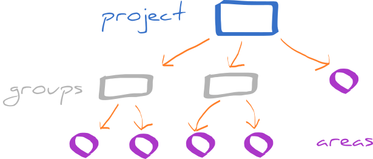

Projects, groups and areas
==========================

The way the non-profit organizations follow their mission are projects. Projects are collaborative enterprises, with well-defined goals, and dedicated team of people behind them. Each project has also some management structure that defines the organizational units, their relationships, responsibilities and roles. For smaller projects, the structure is very simple, but as they grow, there is an increasing need to make it more formal. Many projects also start as events for a local community. The success of the project often inspires other people to create similar events in another area, with the help of the original leaders who offer their guidance and experience.

In Cantiga, almost everything happens within *places* which represent different projects and organizational units within them. The users are members of one or more places and each place has its own *workspace*, where they users can work, e.g. by taking part in the discussions, tracking the progress, taking online courses, etc. There are three types of places in Cantiga that form a hierarchy: projects, groups and areas. The relationship between them is shown in the following diagram:

**Project** is always a top-level place that further divides into groups and areas. Project workspace offers tools for managing the projects from a central perspective. The members are usually main leaders and people who coordinate the project on a central level. For each project, the organization may decide to use a different set of modules offered by Cantiga to match its needs. In Cantiga, projects are isolated: members of project A do not see what is going on in project B, unless they are members of project B, too.

**Group** is an organizational unit inside the project. It can be adapted for many different purposes. Groups are defined by project managers. Currently, they can form only a flat hierarchy (the group cannot be a part of another group), but this is going to change in future versions of Cantiga.

**Area** represents a single geographical area, where the project is held (hence the name), e.g. single city. Area members are usually local leaders who are responsible for the project in their place of living. Areas can be directly associated with the project, or assigned to groups. Areas can be defined in to ways:

 * created explicitly by project managers,
 * created by local leaders.
 
In the second case, Cantiga offers a workflow for requesting the area by the local leader, and verifying the requests by project members.
