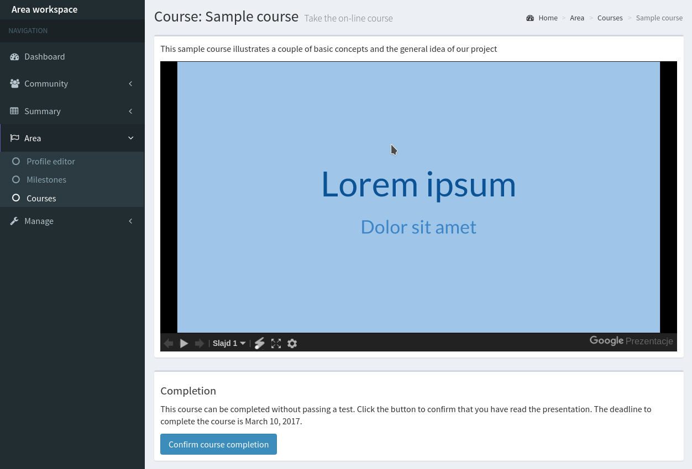

Creating courses
================

The course module provides the on-line course and training service for area leaders. You can deliver the training materials as Google Slides or Prezi prezentations, optionally with test questions. The area leaders can watch the presentation, and then take the test to certify that they read and understood the material. The project and group managers can track the course progress within the areas.

Currently, it is not possible to create courses for group and project members. This limitation is going to be removed in the future releases of Cantiga.

To access the course management panel, perform the following steps:

1. click on the *workspace selector*,
2. select the project,
3. in the *workspace menu*, expand **Manage** section and click on **Courses**.

-----------------
Creating a course
-----------------

In the course management panel, click on the **Insert** button. The course creation form will appear. The course presentation needs to be published on the Internet in Google Slides or Prezi. Copy the URL to the presentation and paste it into **Presentation URL** field.

Note that the presentation is not visible to the area leaders unless you select **Is published?**

------------------
Preparing the test
------------------

To create a test, you need to create an XML file with the list of questions, available answers and information, which answers are correct. Both single- and multi-choice questions are supported. To upload a test, perform the following steps:

1. go to the course management panel,
2. select the course from the list,
3. expand the **Manage** list, and select **Upload test** option,
4. select the XML file with the test questions on a disk,
5. click **Upload**.

The number of questions the participants need to answer, can be configured in the project settings by project managers (**Project workspace > Manage > Settings**).

---------------
Taking the test
---------------

The area leaders can view the presentations for all the published courses:

If the course has a test, the area leader can see **Start the test!** button which takes him or her to the test page. The system displays the questions in the random order. If the number of questions in the test file is bigger than the number of questions the participant needs to answer, the questions are chosen randomly. The test is time-limited; the system assumes 1 minute per single question.

The participant shall complete the test within the specified time limit, and avoid closing the browser or using *Back* button in the browser. Such actions may result in the inability to complete the test. If the time passes or the participant does not score at least 80% of correct answers, the test is failed, and the next attempt may be taken after 24 hours.

The test can be taken independently by all the area leaders within the given area, and the individual progress can be tracked in the area page. However, to mark the course as completed within the given area, it is enough for a single leader to pass the test.

If the course does not have a test, the leader marks the completion of the course by clicking **Confirm course completion** button. Note that this is only a good faith certification. There is no technical way to verify that the leader actually read the presentation.
