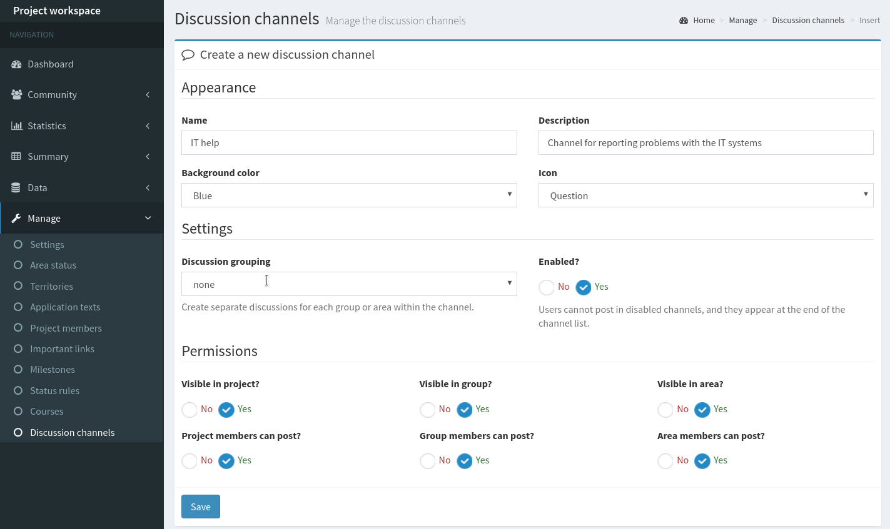
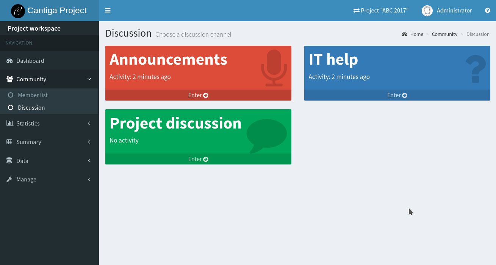
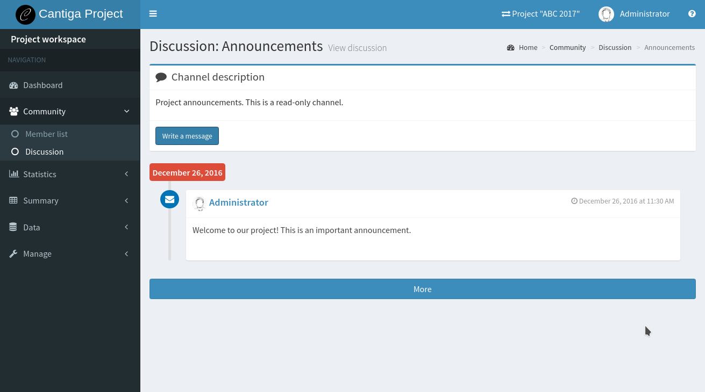
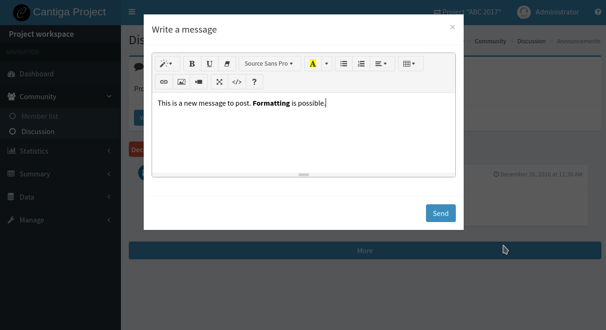

Creating discussion channels
============================

Discussion channels allow the volunteers communicating one with another. The discussions are organized into channels, and the archive is always available for everyone who can see the given channel. Cantiga offers rich options to control the permissions to view and post messages.

-----------------
Creating channels
-----------------

Channels can be created by *project managers*. To create a channel:

1. go to the *project workspace*,
2. expand **Manage** section from the *workspace menu*,
3. select **Discussion channels**,
4. click **Insert**.

The channel creation form appears:

Here you can set the name and description for the channel, as well as some appearance options. In the discussion panel, the channels appear as color boxes (see screenshot below), and you can choose the color and icon for the channel box. It is also possible to mark the channel as *Disabled*. It is not possible to post in disabled channels, however, they are still visible and the discussion archive can be still accessed. To distinguish the disabled channels, they appear at the end of the channel list, and their box is grey.

Let's take a look at the permissions and other settings. A very important setting is **Discussion grouping**. By default, the channel hosts a single discussion for all the places. With this setting, it is possible to create separate discussions for each group or area. Take a look at some of the example channel configurations presented below to learn more, what you can do with this setting. Permissions allow you controlling who can post and view the channel.

**Note**: if you use the discussion grouping *by group* or *by area*, it makes no sense to set the channel visibility for upstream places (e.g. projects). If the channel hosts or area discussions, there is no global project discussion, so the project members won't be able to see the channel regardless of the **Visible in projects** property.

**Note**: channels are not shared between projects. A channel created for project A is not accessible by the members of project B, unless they are also members of project A.

----------------------
Example configurations
----------------------

Here you can find some practical, example channel configuration.

^^^^^^^^^^^^^^
Public channel
^^^^^^^^^^^^^^

A channel, where all the project, group and area members can post. For big projects with hundreds of volunteers, managing such a channel can be challenging. It is recommended to use them only for discussions with a well-defined topic (e.g. *IT help*), where fast response time is critical.

To create a public channel, set:

 * **Discussion grouping** = none
 * **Visible in projects** = Yes
 * **Visible in groups** = Yes
 * **Visible in areas** = Yes
 * **Project members can post** = Yes
 * **Group members can post** = Yes
 * **Area members can post** = Yes

^^^^^^^^^^^^^^^^^
Announcement list
^^^^^^^^^^^^^^^^^

A channel for posting important announcements by the project leaders.

To create an announcement list:

 * **Discussion grouping** = none
 * **Visible in projects** = Yes
 * **Visible in groups** = Yes
 * **Visible in areas** = Yes
 * **Project members can post** = Yes
 * **Group members can post** = No
 * **Area members can post** = No

^^^^^^^^^^^^^^^^^^^^^^^
Private area discussion
^^^^^^^^^^^^^^^^^^^^^^^

Each area can have a private discussion for its members. Different areas see their own discussions.

To create a private area discussion:

 * **Discussion grouping** = by area
 * **Visible in projects** = No
 * **Visible in groups** = No
 * **Visible in areas** = Yes
 * **Project members can post** = No
 * **Group members can post** = No
 * **Area members can post** = Yes

^^^^^^^^^^^^^^^^^^^^^^^^
Private group discussion
^^^^^^^^^^^^^^^^^^^^^^^^

Each group can have a private discussion for its members, which is not visible by the associated areas. Different groups see their own discussions.

To create a private group discussion:

 * **Discussion grouping** = by group
 * **Visible in projects** = No
 * **Visible in groups** = Yes
 * **Visible in areas** = No
 * **Project members can post** = No
 * **Group members can post** = Yes
 * **Area members can post** = No

^^^^^^^^^^^^^^^^^^^^^^^^^^
Private project discussion
^^^^^^^^^^^^^^^^^^^^^^^^^^

Private discussion for the project members, which is not visible by group and area leaders.

To create a private project discussion:

 * **Discussion grouping** = none
 * **Visible in projects** = Yes
 * **Visible in groups** = No
 * **Visible in areas** = No
 * **Project members can post** = Yes
 * **Group members can post** = No
 * **Area members can post** = No

^^^^^^^^^^^^^^^^^^^^^^^^^^^^^^^^^^^^^^^^^^^^
Communication between group and area leaders
^^^^^^^^^^^^^^^^^^^^^^^^^^^^^^^^^^^^^^^^^^^^

Channel where the group leaders can talk to the leaders of the associated areas. Each group has its own separate discussion.

To create a channel for communication between group and area leaders:

 * **Discussion grouping** = by group
 * **Visible in projects** = No
 * **Visible in groups** = Yes
 * **Visible in areas** = Yes
 * **Project members can post** = No
 * **Group members can post** = Yes
 * **Area members can post** = Yes

-----------
Discussions
-----------

In project, group and area workspaces, the discussion panel can be found in **Community > Discussion** link in the *workspace menu*. After clicking the link, the list of channels appears:

Click on the channel to open the discussion:

The discussion shows last 20 messages grouped by date. To read more posts, click the **More** button. If there are no more posts to show, the button becomes disabled.

To post a new message, click **Write a message** button below the channel description. A modal dialog appears with the text editor:

The editor allows formatting the entered message. Currently, it is not possible to post attachments, images or videos into the discussion, however, such a feature is planned to be added in future releases of Cantiga.
