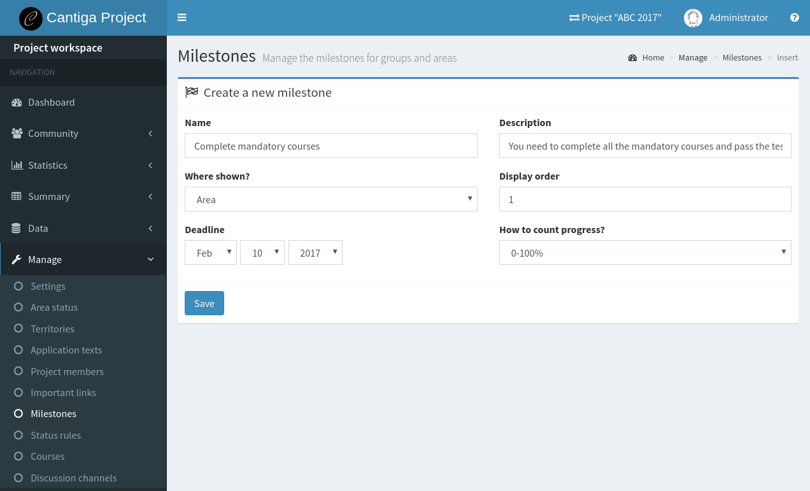
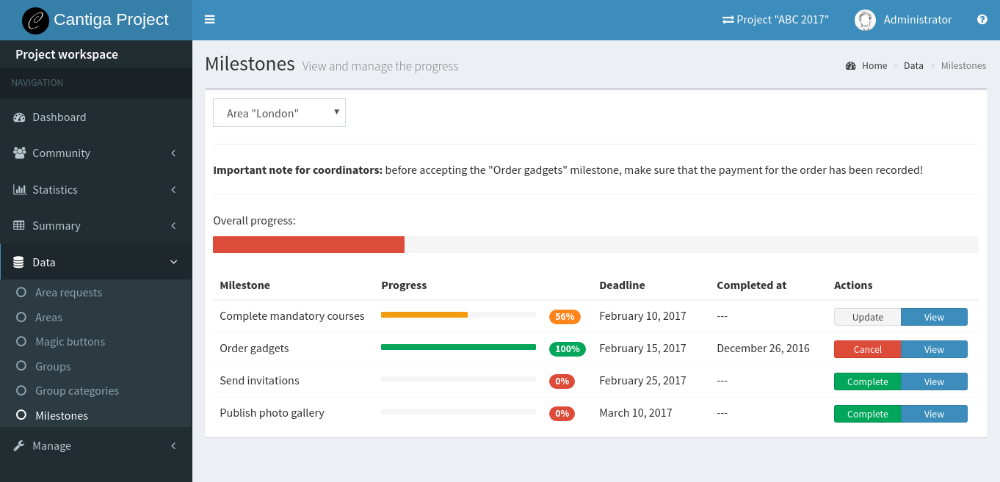
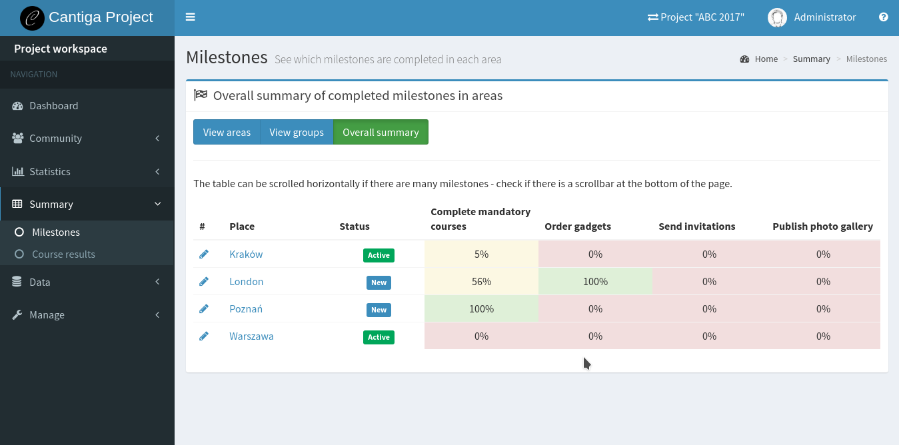

.. _creating_milestones:

Creating milestones
===================

Milestones allow tracking the progress of the project. Project managers can define milestones for the project, groups and areas. The milestones for each place type are distinct. Area leaders see other milestones than group leaders, and project leaders. All the places of the same type aim to complete the same set of milestones, and the project members can compare the overall progress between them.

-------------------
Managing milestones
-------------------

To create milestones in the project, you have to be a *project manager*. It is recommended to define the set of the milestones at the very beginning of the project, so that everybody is aware of the important deadlines and things that need to be done. To access the milestone management panel:

1. go to the *project workspace*,
2. expand **Manage** section from the *workspace menu*,
3. select **Milestones**.

The list shows the defined milestones for all the types of places. Click **Insert** button to create a new milestone:

The milestone has the following properties:

 * **Name** - name of the milestone (keep it short, e.g. "Complete on-line courses"),
 * **Description** - detailed description what needs to be done,
 * **Where shown** - specify the type of the place (project, group or area), where this milestone applies to,
 * **Display order** - the milestones are displayed in the order defined by the numbers specified by this field; the range of numbers does not have to be continuous, and the numbers can be duplicated,
 * **Deadline** - deadline for the milestone completion,
 * **How to count progress?** - there are two types of milestones:
     * *binary*: completed or not completed,
     * *0-100%*: allows specifying the completion in percents.

Note that the **Where shown** and **How to count progress?** properties cannot be changed once the milestone is created.

-----------------
Updating progress
-----------------

To update the milestone progress, you have to be a project or a group member. Project members can manage the progress of all the areas, groups and the project itself. Group members can manage the progress of the associated areas only. To access the milestone progress editor:

1. go to the project or group workspace,
2. expand **Data** section from the *workspace menu*,
3. select **Milestones**.

The editor is presented below:

The select box in the top-left corner allows switching between available places. After selecting the place, the list of the milestones appears with the progress bar showing the completion of each of them. Click **View** to read a detailed description for each milestone.

Binary milestones have the **Complete** or **Cancel** buttons which allow switching between the completion status. Percent-based milestones have the **Update** button. Click on it to open a modal dialog where you can enter the current progress value in percent. The value of 100% is marks the milestone as completed.

**Note:** area leaders can view their progress on a similar page in their workspace, but without the ability to edit the progress.

**Hint:** the text above the table can be customized by project managers in **Manage > Application texts** panel, by creating an application text ``milestone:editor:project``, ``milestone:editor:group`` or ``milestone:editor:area``.

-----------------
Milestone summary
-----------------

The overall summary of the areas and groups can be tracked in a milestone summary panel:

1. go to project or group workspace,
2. expand **Summary** section from the *workspace menu*,
3. select **Milestones**.

The summary is presented below:

There are three types of tables available:

1. **View areas** shows all the areas with their overall progress and the number of completed milestones; the areas are sorted from the most to the least advanced,
2. **View groups** shows a similar view, but for the groups,
3. **Overall summary** shows all the areas and all the area milestones in a single table, like on the screenshot.

