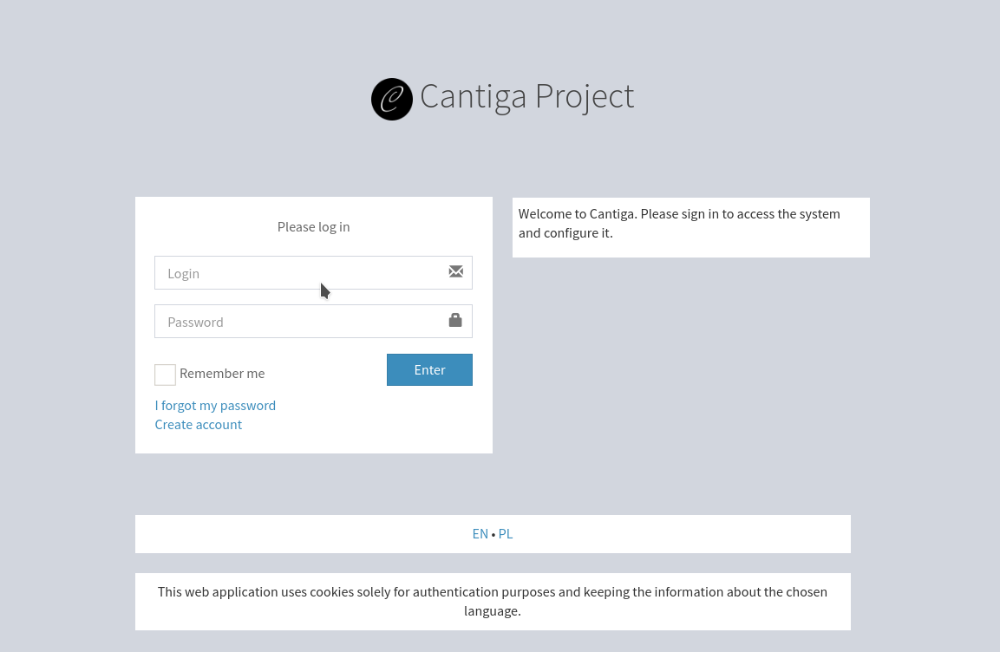
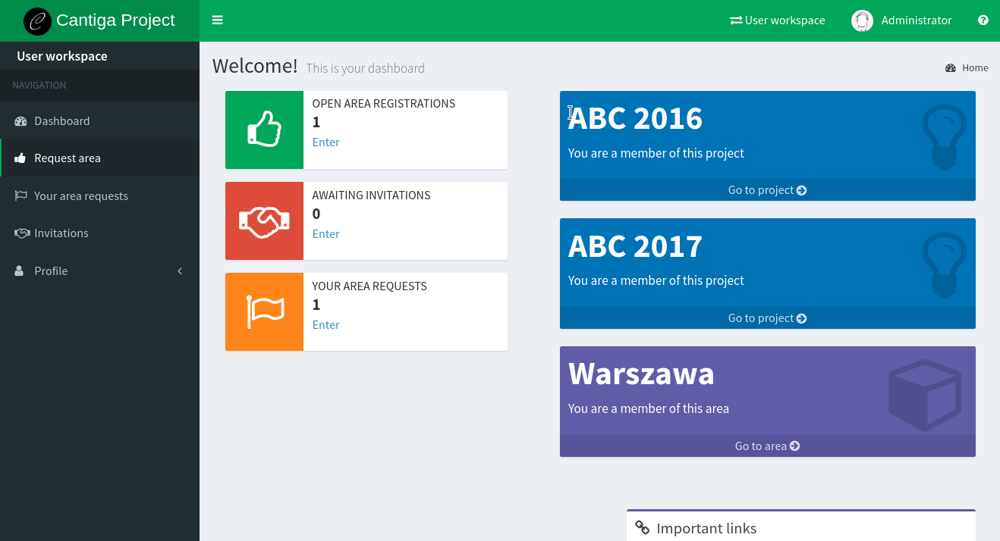

Getting around
==============

In order to use Cantiga, you need to have an account. The welcome screen to the system shows nothing more than just a login screen:

The bottom bar allows choosing the current language. Under the form, there are two links for creating a new account and recovering the lost password. The default credentials available after the installation are:

 * login: **administrator**
 * password: **Admin56789**
 
Navigation
----------

After logging in, the user can see a dashboard:

Let's take a look at the user interface of Cantiga.

 * To the left, there is a **workspace menu**. You can use it to access workspace-specific pages.
 * In the top-left corner, you see the logo and the application name. The icon next to it shows and hides the menu.
 * At the top, you can see the **top bar**, with the workspace selector, profile information and help icon.
 * At the bottom, you can see the footer.
 * The central part of the screen displays the content.

In Cantiga, everything happens within a workspace. As we know from the introduction chapters, each place has its own workspace. There are also two special workspaces:

 * *User workspace* allows the users to manage their profiles,
 * *Admin workspace* allows the administrators to configure and manage Cantiga system.

After logging in, everyone lands in their user workspace. The name of the workspace is shown under the logo, and its type is marked by the color of the top bar:

 * green color: user workspace,
 * red color: admin workspace,
 * blue color: project workspace,
 * white color: group workspace,
 * purple color: area workspace.
 
Useful terms:

top bar
   the narrow bar at the top of the page, whose color describes the type of the current workspace.

workspace menu
   menu with links to different workspace pages.

Customizing the profile
-----------------------

In the user workspace menu, click on the **Profile** option to expand it. You can see the following options for managing the profile:

 * **Contact data** - manage your contact data visible by other users,
 * **Settings** - change the account settings, such as system language, and the timezone,
 * **Manage photo** - upload your photo or avatar,
 * **Change password** - change the password,
 * **Change e-mail** - change the account e-mail used for sending notifications, and recovering password. It is not visible by other users.

Switching between workspaces
----------------------------

To switch between workspaces, use the *workspace selector*. It can be found on the *top bar* and it is represented by an icon of two opposing arrows and the name of the current workspace. Click on it to expand the list of available workspaces and places. You can use it to navigate between places, and your user workspace. In addition, the links to the places you are a member of are shown on the user dashboard.

Useful terms:

workspace selector
   the icon on the top bar that allows switching between workspaces.

Signing out
-----------

To leave Cantiga, click on your avatar and user name on the top bar. A small dialog box appears. Click on the **Sign out** button to leave the system. The dialog box also offers a quick access to some of the profile options.

Accessing help
--------------

The question mark icon in the top right corner opens the help pages. Each workspace has a a predefined set of pages that can be edited by administrators, and available in different languages. Note that in the clean installation, all of the help pages are empty.
