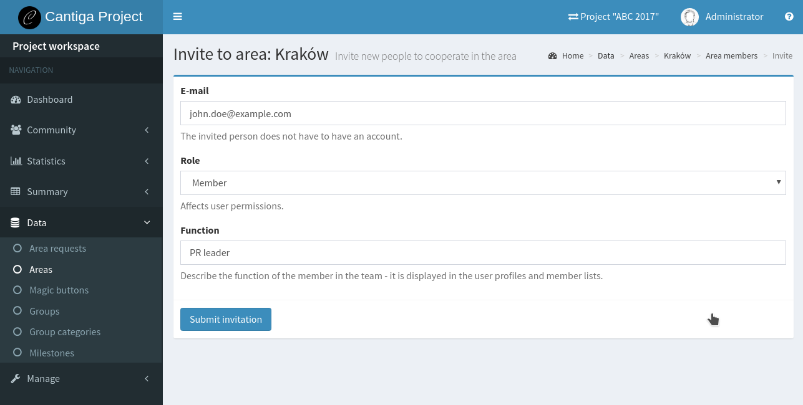
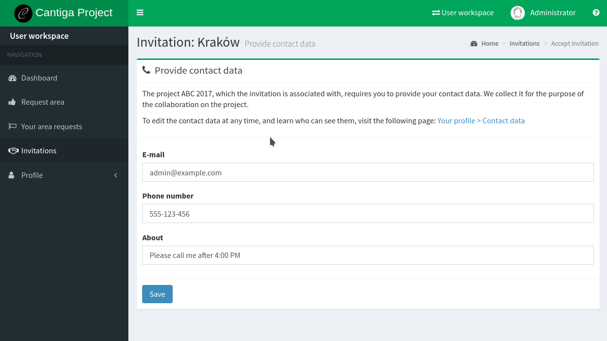

.. _inviting_people:

Inviting people
===============

New members join the places through invitations from place managers. You can invite both users who already have an accoun in Cantiga, and users who first need to register one. If the invited user does not have an account, he or she will receive an e-mail with the information about the invitation and the instructions how to create account. The registered user sees new invitations immediately in his/her profile.

---------------------
Inviting a new member
---------------------

Invitations can be sent by many users:

 * project managers and administrators can invite others to projects,
 * project members can invite others to groups and areas,
 * group managers can invite others to their group,
 * group members can invite others to the assigned areas,
 * area managers can invite others to their area.

The membership management panel shows all the members of the given place, and the **Invite** button. After clicking on it, you can see the following panel:

To invite someone, you need to know his or her e-mail address. It does not matter whether the invited person has an account in the system or not. You must also specify the role which describes the user permissions, and the function. The function is displayed in user profiles and provides a hint for the others what the given person is responsible for.

---------------------------------
Viewing and accepting invitations
---------------------------------

The notification about incoming invitation is received via e-mail. If the user does not have an account, the e-mail provides a guide and a link to create it. After creating an account. After creating an account, the invitation can be seen in the **Invitations** panel available in the *user workspace*:

.. image:: ../_static/cantiga-invitations.png

Click on **Revoke**, if you decide not to join the given place. Otherwise, click **Accept**.

A successful cooperation on a project requires the members to know the contact data to the others. Cantiga can serve as a address book for the members of the same place. If you accept the invitation, the system asks you to review your contact data for the given project. They must be filled in, if this is the first place in the given project you join. Otherwise, the form will be already filled with the previously entered data.

------------------------------
Dealing with incorrect e-mails
------------------------------

Sometimes it may happen that the invitation was sent to e-mail A, but the invited person used a different e-mail address to create his or her account. In this case, Cantiga is not able to recognize that the account already exists and treats the invitation as sent to an unregistered person. However, such an invitation is not lost.

Each invitation message sent to an unknown e-mail address contains a special invitation key. This invitation key can be copy-pasted to the **Find invitation** text field at the **Invitations** page, to bind it to the user account. After binding, the invitation can be answered in a normal way.
