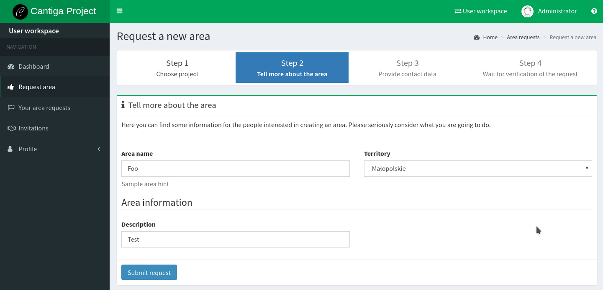
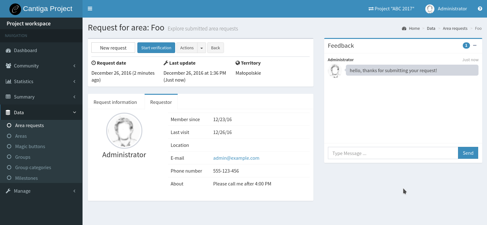

Requesting areas
================

New areas can be created in two ways:

1. they can be created directly by project members,
2. they can be requested by local leaders who created an account in the system.

-------------
Configuration
-------------

In order to enable area registration, some initial configuration must be done:

1. the administrator must set **Area registration allowed** option to ``Yes`` for the given project,
2. the project manager must define at least one territory for the project.

The list of territories usually contains the list of provinces (or other units of the administrative division) in the country, and the leaders pick one of them during the area registration. As a project manager, go to **Project workspace > Manage > Territories** to define the list of territories for the project.

----------------
Requesting areas
----------------

Anyone who is interested in creating an area for our project, shall create an account in the system. Once logged in, the user can see the list of the projects, where the area registration is currently open. After selecting a project, the user is taken to the area request wizard:

The wizard consists of four steps:

1. choosing a project,
2. providing the information about the area,
3. providing the contact data,
4. waiting for the area request verification.

**Hint**: the area request form and area profiles can be customized with little programming skills. See: :ref:`customize_requests_areas`.

The user can see his or her area requests in the user workspace. Each request contains a feedback window which can be used to communicate with the project leaders.

----------------------
Verifying the requests
----------------------

Each request must be verified by the project members before creating an area. Below you can see a sample request, as seen by project members in *project workspace*:

The request goes through a simple workflow: *New > Verification > Approved or rejected*. To start the verification, click on the **Start verification** button at the top of the request details.

The detail page contains some other useful information:

 * preview of all the information provided by the requestor,
 * contact data of the requestor,
 * feedback chat which can be used for communication with the requestor.

After approving the request, the area is created immediately and the requestor is added as the manager.

Cantiga sends e-mail notifications for each change of the state of the request.

**Hint**: there are some useful charts related to the area requests in **Statistics > Area requests** panel.
